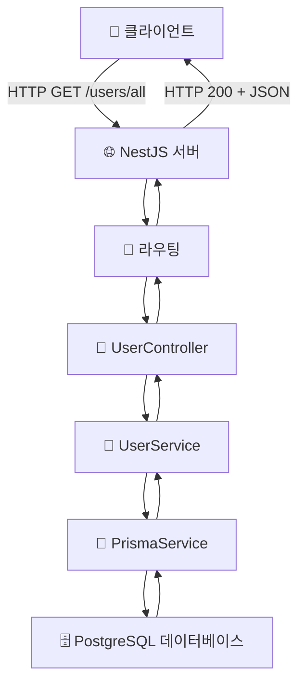
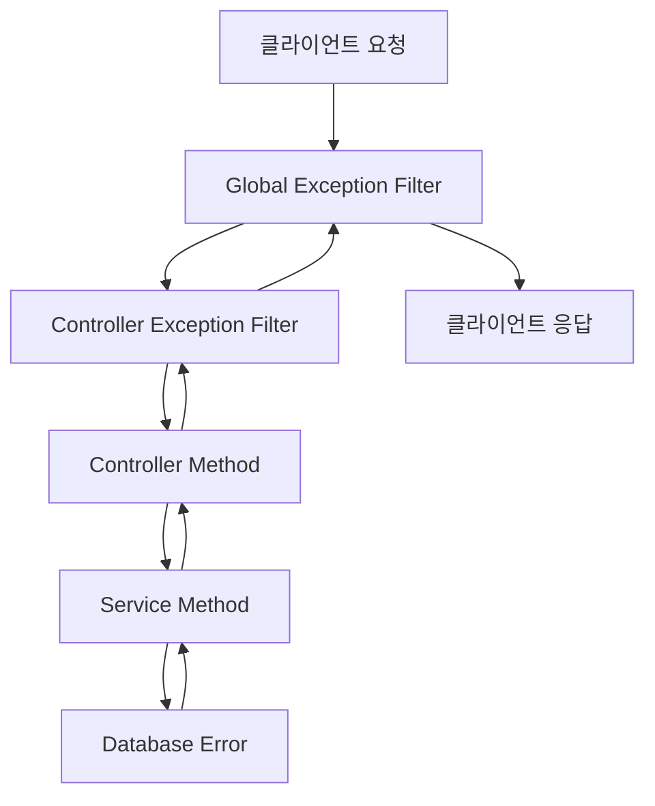

# 🔄 NestJS 데이터 흐름 가이드: GET /users/all

## 📋 목차

1. [개요](#개요)
2. [전체 흐름도](#전체-흐름도)
3. [단계별 상세 설명](#단계별-상세-설명)
4. [NestJS 핵심 개념](#nestjs-핵심-개념)
5. [코드 분석](#코드-분석)
6. [데이터베이스 구조](#데이터베이스-구조)
7. [트러블슈팅](#트러블슈팅)

---

## 📖 개요

이 문서는 `GET /users/all` API 호출 시 NestJS 애플리케이션 내에서 데이터가 어떻게 흐르는지를 **초보자 관점**에서 최대한 자세히 설명합니다.

### 🎯 학습 목표

- NestJS의 기본 아키텍처 이해
- HTTP 요청이 어떻게 처리되는지 파악
- Controller → Service → Database의 흐름 이해
- Prisma ORM의 역할 파악

---

## 🔄 전체 흐름도



---

## 📊 단계별 상세 설명

### 1️⃣ 클라이언트 요청 (Client Request)

```bash
# 실제 HTTP 요청 예시
GET http://localhost:3000/users/all
Accept: application/json
```

**무슨 일이 일어나는가?**

- 브라우저, Postman, 또는 다른 애플리케이션에서 HTTP GET 요청을 보냄
- 요청 URL: `http://localhost:3000/users/all`
- HTTP 메서드: `GET`

### 2️⃣ NestJS 서버 수신 (Server Reception)

**NestJS 내부에서 일어나는 일:**

1. **Express.js 기반 서버**가 요청을 받음
2. **미들웨어 체인**을 통과 (인증, 로깅, CORS 등)
3. **라우팅 엔진**이 URL을 분석함

### 3️⃣ 라우팅 (Routing)

```typescript
// 라우팅 매칭 과정
'/users/all' → @Controller('users') + @Get('/all')
```

**매칭 과정:**

1. URL `/users/all`을 분석
2. `@Controller('users')` → 기본 경로 `/users`와 매칭
3. `@Get('/all')` → 나머지 경로 `/all`과 매칭
4. `UserController`의 `getUsers()` 메서드로 라우팅

### 4️⃣ 컨트롤러 실행 (Controller Execution)

```typescript
// user.controller.ts
@Get('/all')
@ApiOperation({ summary: '모든 사용자 조회' })
@ApiResponse({
  status: 200,
  description: '사용자 목록을 성공적으로 조회했습니다.',
  type: [UserResponseDto],
})
async getUsers(): Promise<User[]> {
  return this.userService.getUsers(); // ← 이 부분이 실행됨
}
```

**컨트롤러에서 일어나는 일:**

1. `@Get('/all')` 데코레이터가 이 메서드를 HTTP GET 요청 핸들러로 등록
2. `@ApiOperation`, `@ApiResponse` 등은 Swagger 문서화용 (실제 로직에는 영향 없음)
3. `async getUsers()` 메서드가 호출됨
4. **의존성 주입**된 `userService`의 `getUsers()` 메서드를 호출

### 5️⃣ 서비스 실행 (Service Execution)

```typescript
// user.service.ts
async getUsers(): Promise<User[]> {
  return this.prisma.user.findMany(); // ← 이 부분이 실행됨
}
```

**서비스에서 일어나는 일:**

1. `UserService`의 `getUsers()` 메서드가 실행됨
2. **의존성 주입**된 `prisma` (PrismaService 인스턴스)를 사용
3. `prisma.user.findMany()` 호출 → 모든 사용자 데이터 조회 요청

### 6️⃣ Prisma ORM (Database Abstraction Layer)

```typescript
// prisma.service.ts
@Injectable()
export class PrismaService extends PrismaClient implements OnModuleInit {
  async onModuleInit() {
    await this.$connect(); // 데이터베이스 연결
  }
}
```

**Prisma에서 일어나는 일:**

1. `findMany()` 메서드가 SQL 쿼리로 변환됨
2. 실제로 생성되는 SQL:
   ```sql
   SELECT id, name, email, "createdAt", "createUser", "updatedAt", "updateUser"
   FROM "User";
   ```
3. PostgreSQL 데이터베이스에 쿼리 전송

### 7️⃣ 데이터베이스 처리 (Database Processing)

**PostgreSQL에서 일어나는 일:**

1. SQL 쿼리를 받아서 파싱
2. `User` 테이블에서 모든 레코드 검색
3. 결과를 Prisma로 반환

**예시 데이터베이스 응답:**

```json
[
  {
    "id": "clxxx1",
    "name": "김철수",
    "email": "kim@example.com",
    "createdAt": "2024-01-01T00:00:00Z",
    "createUser": "admin",
    "updatedAt": "2024-01-01T00:00:00Z",
    "updateUser": "admin"
  },
  {
    "id": "clxxx2",
    "name": "이영희",
    "email": "lee@example.com",
    "createdAt": "2024-01-02T00:00:00Z",
    "createUser": "admin",
    "updatedAt": "2024-01-02T00:00:00Z",
    "updateUser": "admin"
  }
]
```

### 8️⃣ 역방향 데이터 흐름 (Reverse Data Flow)

**데이터가 다시 클라이언트로 돌아가는 과정:**

1. **Database → Prisma**: 원시 데이터 반환
2. **Prisma → Service**: TypeScript 객체로 변환하여 반환
3. **Service → Controller**: `Promise<User[]>` 반환
4. **Controller → NestJS**: HTTP 응답 객체 생성
5. **NestJS → Client**: JSON 형태로 직렬화하여 HTTP 200 응답

### 9️⃣ 최종 HTTP 응답 (Final HTTP Response)

```http
HTTP/1.1 200 OK
Content-Type: application/json
Content-Length: xxx

[
  {
    "id": "clxxx1",
    "name": "김철수",
    "email": "kim@example.com",
    "createdAt": "2024-01-01T00:00:00.000Z",
    "createUser": "admin",
    "updatedAt": "2024-01-01T00:00:00.000Z",
    "updateUser": "admin"
  },
  {
    "id": "clxxx2",
    "name": "이영희",
    "email": "lee@example.com",
    "createdAt": "2024-01-02T00:00:00.000Z",
    "createUser": "admin",
    "updatedAt": "2024-01-02T00:00:00.000Z",
    "updateUser": "admin"
  }
]
```

---

## 🏗️ NestJS 핵심 개념

### 🎯 의존성 주입 (Dependency Injection)

```typescript
// UserController에서
constructor(private readonly userService: UserService) {}
//           ↑ 자동으로 UserService 인스턴스가 주입됨

// UserService에서
constructor(private prisma: PrismaService) {}
//           ↑ 자동으로 PrismaService 인스턴스가 주입됨
```

**왜 의존성 주입을 사용하는가?**

- **느슨한 결합**: 클래스들이 서로 독립적
- **테스트 용이성**: Mock 객체로 쉽게 교체 가능
- **코드 재사용성**: 같은 Service를 여러 Controller에서 사용 가능

### 🏷️ 데코레이터 (Decorators)

```typescript
@Controller('users')    // ← 클래스 데코레이터
export class UserController {

  @Get('/all')         // ← 메서드 데코레이터
  @ApiOperation(...)   // ← 추가 메타데이터
  async getUsers() {
    // ...
  }
}
```

**데코레이터의 역할:**

- **메타데이터 추가**: NestJS가 런타임에 이 정보를 읽어서 라우팅 설정
- **AOP (Aspect-Oriented Programming)**: 횡단 관심사 처리
- **코드 간소화**: 복잡한 설정을 간단한 어노테이션으로 대체

### 🔄 비동기 처리 (Async/Await)

```typescript
async getUsers(): Promise<User[]> {
  return this.userService.getUsers();
  //     ↑ Promise를 반환하는 비동기 메서드
}
```

**왜 비동기인가?**

- **데이터베이스 I/O**: 네트워크 통신이므로 시간이 걸림
- **논블로킹**: 다른 요청들이 기다리지 않음
- **성능 향상**: 동시에 여러 요청 처리 가능

---

## 🔍 코드 분석

### UserController 상세 분석

```typescript
@ApiTags('users') // Swagger에서 'users' 태그로 그룹화
@Controller('users') // 기본 경로를 '/users'로 설정
export class UserController {
  constructor(private readonly userService: UserService) {}
  //          ↑ readonly: 불변성 보장
  //          ↑ private: 외부에서 접근 불가
  //          ↑ 의존성 주입으로 UserService 인스턴스 받음

  @Get('/all') // GET /users/all 엔드포인트 정의
  @ApiOperation({ summary: '모든 사용자 조회' })
  @ApiResponse({
    status: 200,
    description: '사용자 목록을 성공적으로 조회했습니다.',
    type: [UserResponseDto], // 배열 형태의 UserResponseDto 반환
  })
  async getUsers(): Promise<User[]> {
    return this.userService.getUsers();
  }
}
```

### UserService 상세 분석

```typescript
@Injectable() // 의존성 주입 가능한 클래스로 표시
export class UserService {
  constructor(private prisma: PrismaService) {}
  //          ↑ PrismaService 의존성 주입

  async getUsers(): Promise<User[]> {
    return this.prisma.user.findMany();
    //     ↑ Prisma Client의 메서드 사용
    //     ↑ findMany(): 모든 레코드 조회
  }
}
```

### PrismaService 상세 분석

```typescript
@Injectable() // NestJS 서비스로 등록
export class PrismaService extends PrismaClient implements OnModuleInit {
  //                         ↑ Prisma Client 상속  ↑ 모듈 초기화 인터페이스

  async onModuleInit() {
    await this.$connect(); // 데이터베이스 연결 설정
  }
}
```

---

## 🗄️ 데이터베이스 구조

### User 테이블 스키마

```prisma
model User {
  id         String   @id @default(cuid())      // 기본키, 자동 생성
  name       String                              // 사용자 이름
  email      String   @unique                    // 이메일 (유니크 제약)
  createdAt  DateTime @default(now())            // 생성 시간
  createUser String                              // 생성자
  updatedAt  DateTime @updatedAt                 // 수정 시간 (자동 업데이트)
  updateUser String                              // 수정자

  // Relations (다른 테이블과의 관계)
  userVirtualMachines    UserVirtualMachineMapping[]
  createdTestCases       TestCase[]                  @relation("TestCaseCreator")
  executedTestCases      TestCase[]                  @relation("TestCaseExecutor")
  // ... 기타 관계들
}
```

### 실제 PostgreSQL 테이블

```sql
CREATE TABLE "User" (
  "id" TEXT NOT NULL,
  "name" TEXT NOT NULL,
  "email" TEXT NOT NULL,
  "createdAt" TIMESTAMP(3) NOT NULL DEFAULT CURRENT_TIMESTAMP,
  "createUser" TEXT NOT NULL,
  "updatedAt" TIMESTAMP(3) NOT NULL,
  "updateUser" TEXT NOT NULL,

  CONSTRAINT "User_pkey" PRIMARY KEY ("id")
);

CREATE UNIQUE INDEX "User_email_key" ON "User"("email");
```

---

## ⚡ 성능 최적화 고려사항

### 1. 페이지네이션

현재 `findMany()`는 모든 데이터를 가져옵니다. 사용자가 많아지면:

```typescript
// 개선된 버전
async getUsers(page: number = 1, limit: number = 10): Promise<User[]> {
  return this.prisma.user.findMany({
    skip: (page - 1) * limit,    // 건너뛸 레코드 수
    take: limit,                 // 가져올 레코드 수
    orderBy: { createdAt: 'desc' } // 정렬
  });
}
```

### 2. 필드 선택

모든 필드가 필요하지 않다면:

```typescript
async getUsers(): Promise<Partial<User>[]> {
  return this.prisma.user.findMany({
    select: {
      id: true,
      name: true,
      email: true,
      // 필요한 필드만 선택
    }
  });
}
```

---

## 🐛 트러블슈팅

### 일반적인 에러들

#### 1. 데이터베이스 연결 에러

```
Error: Cannot connect to database
```

**해결방법:**

- `DATABASE_URL` 환경변수 확인
- PostgreSQL 서버 실행 상태 확인
- 네트워크 연결 확인

#### 2. Prisma 클라이언트 미생성

```
Error: Prisma Client is not yet generated
```

**해결방법:**

```bash
npx prisma generate
```

#### 3. 스키마 동기화 에러

```
Error: Database schema is not in sync
```

**해결방법:**

```bash
npx prisma db push
# 또는
npx prisma migrate dev
```

### 디버깅 팁

#### 1. 로깅 추가

```typescript
async getUsers(): Promise<User[]> {
  console.log('🔍 사용자 목록 조회 시작');
  const users = await this.prisma.user.findMany();
  console.log(`✅ ${users.length}명의 사용자 조회 완료`);
  return users;
}
```

#### 2. Prisma 쿼리 로깅

```typescript
// prisma/schema.prisma
generator client {
  provider = "prisma-client-js"
  log      = ["query", "info", "warn", "error"]
}
```

#### 3. HTTP 요청 테스트

```bash
# curl로 테스트
curl -X GET http://localhost:3000/users/all

# 또는 HTTPie
http GET localhost:3000/users/all
```

---

## 🚨 에러 핸들링 추가하기

### 개념 설명

**에러 핸들링**은 애플리케이션에서 발생할 수 있는 예외 상황을 적절히 처리하여 사용자에게 의미 있는 응답을 제공하는 것입니다. NestJS는 다양한 레벨에서 에러를 처리할 수 있는 강력한 메커니즘을 제공합니다.

### NestJS 에러 처리 계층



### 1. 기본 HTTP 예외 처리

```typescript
// user.service.ts
import { Injectable, NotFoundException, BadRequestException } from '@nestjs/common';

@Injectable()
export class UserService {
  constructor(private prisma: PrismaService) {}

  async getUsers(): Promise<User[]> {
    try {
      const users = await this.prisma.user.findMany();

      if (!users || users.length === 0) {
        throw new NotFoundException('사용자를 찾을 수 없습니다.');
      }

      return users;
    } catch (error) {
      // Prisma 에러 처리
      if (error.code === 'P2002') {
        throw new BadRequestException('중복된 데이터입니다.');
      }

      // 알려지지 않은 에러
      throw new InternalServerErrorException('서버 내부 오류가 발생했습니다.');
    }
  }

  async getUserById(id: string): Promise<User> {
    if (!id || typeof id !== 'string') {
      throw new BadRequestException('유효하지 않은 사용자 ID입니다.');
    }

    const user = await this.prisma.user.findUnique({
      where: { id },
    });

    if (!user) {
      throw new NotFoundException(`ID가 ${id}인 사용자를 찾을 수 없습니다.`);
    }

    return user;
  }
}
```

### 2. 커스텀 예외 클래스

```typescript
// exceptions/user.exceptions.ts
import { HttpException, HttpStatus } from '@nestjs/common';

export class UserNotFoundException extends HttpException {
  constructor(userId: string) {
    super(
      {
        message: `사용자를 찾을 수 없습니다.`,
        error: 'User Not Found',
        statusCode: HttpStatus.NOT_FOUND,
        userId,
        timestamp: new Date().toISOString(),
      },
      HttpStatus.NOT_FOUND,
    );
  }
}

export class UserAlreadyExistsException extends HttpException {
  constructor(email: string) {
    super(
      {
        message: '이미 존재하는 이메일입니다.',
        error: 'User Already Exists',
        statusCode: HttpStatus.CONFLICT,
        email,
        timestamp: new Date().toISOString(),
      },
      HttpStatus.CONFLICT,
    );
  }
}
```

### 3. 전역 예외 필터

```typescript
// filters/global-exception.filter.ts
import {
  ExceptionFilter,
  Catch,
  ArgumentsHost,
  HttpException,
  HttpStatus,
  Logger,
} from '@nestjs/common';
import { Request, Response } from 'express';

@Catch()
export class GlobalExceptionFilter implements ExceptionFilter {
  private readonly logger = new Logger(GlobalExceptionFilter.name);

  catch(exception: unknown, host: ArgumentsHost): void {
    const ctx = host.switchToHttp();
    const response = ctx.getResponse<Response>();
    const request = ctx.getRequest<Request>();

    let status: number;
    let message: string;
    let error: string;

    if (exception instanceof HttpException) {
      // NestJS HTTP 예외 처리
      status = exception.getStatus();
      const exceptionResponse = exception.getResponse();

      if (typeof exceptionResponse === 'object') {
        message = (exceptionResponse as any).message || exception.message;
        error = (exceptionResponse as any).error || 'Http Exception';
      } else {
        message = exceptionResponse;
        error = 'Http Exception';
      }
    } else if (exception instanceof Error) {
      // 일반 에러 처리
      status = HttpStatus.INTERNAL_SERVER_ERROR;
      message = '서버 내부 오류가 발생했습니다.';
      error = 'Internal Server Error';

      // 개발 환경에서는 상세 에러 정보 제공
      if (process.env.NODE_ENV === 'development') {
        message = exception.message;
      }
    } else {
      // 알 수 없는 예외
      status = HttpStatus.INTERNAL_SERVER_ERROR;
      message = '알 수 없는 오류가 발생했습니다.';
      error = 'Unknown Error';
    }

    // 에러 로깅
    this.logger.error(
      `${request.method} ${request.url} - ${status} - ${message}`,
      exception instanceof Error ? exception.stack : 'No stack trace',
    );

    // 클라이언트 응답
    response.status(status).json({
      statusCode: status,
      timestamp: new Date().toISOString(),
      path: request.url,
      method: request.method,
      error,
      message,
    });
  }
}

// main.ts에 전역 필터 등록
import { GlobalExceptionFilter } from './filters/global-exception.filter';

async function bootstrap() {
  const app = await NestFactory.create(AppModule);

  app.useGlobalFilters(new GlobalExceptionFilter());

  await app.listen(3000);
}
```

### 4. Prisma 에러 처리

```typescript
// services/prisma-error.service.ts
import { Injectable, BadRequestException, ConflictException } from '@nestjs/common';
import { Prisma } from '@prisma/client';

@Injectable()
export class PrismaErrorService {
  handlePrismaError(error: any): never {
    if (error instanceof Prisma.PrismaClientKnownRequestError) {
      switch (error.code) {
        case 'P2002':
          // 유니크 제약 조건 위반
          throw new ConflictException(
            `중복된 값입니다: ${error.meta?.target || '알 수 없는 필드'}`,
          );

        case 'P2025':
          // 레코드를 찾을 수 없음
          throw new BadRequestException('요청한 데이터를 찾을 수 없습니다.');

        case 'P2003':
          // 외래 키 제약 조건 위반
          throw new BadRequestException('참조 무결성 제약 조건 위반입니다.');

        case 'P2014':
          // 관련된 레코드가 존재함
          throw new ConflictException('관련된 데이터가 존재하여 삭제할 수 없습니다.');

        default:
          throw new BadRequestException(`데이터베이스 오류: ${error.message}`);
      }
    }

    if (error instanceof Prisma.PrismaClientUnknownRequestError) {
      throw new BadRequestException('알 수 없는 데이터베이스 오류가 발생했습니다.');
    }

    if (error instanceof Prisma.PrismaClientRustPanicError) {
      throw new BadRequestException('데이터베이스 연결 오류가 발생했습니다.');
    }

    // 기타 에러
    throw error;
  }
}

// user.service.ts에서 사용
@Injectable()
export class UserService {
  constructor(
    private prisma: PrismaService,
    private prismaErrorService: PrismaErrorService,
  ) {}

  async getUsers(): Promise<User[]> {
    try {
      return await this.prisma.user.findMany();
    } catch (error) {
      this.prismaErrorService.handlePrismaError(error);
    }
  }
}
```

### 5. 유효성 검사 에러 처리

```typescript
// dto/create-user.dto.ts
import { IsEmail, IsNotEmpty, IsString, MinLength } from 'class-validator';
import { ApiProperty } from '@nestjs/swagger';

export class CreateUserDto {
  @ApiProperty({ description: '사용자 이름', example: '김철수' })
  @IsNotEmpty({ message: '이름은 필수입니다.' })
  @IsString({ message: '이름은 문자열이어야 합니다.' })
  name: string;

  @ApiProperty({ description: '이메일', example: 'kim@example.com' })
  @IsEmail({}, { message: '유효한 이메일을 입력해주세요.' })
  @IsNotEmpty({ message: '이메일은 필수입니다.' })
  email: string;

  @ApiProperty({ description: '비밀번호', example: 'password123' })
  @IsNotEmpty({ message: '비밀번호는 필수입니다.' })
  @MinLength(8, { message: '비밀번호는 최소 8자 이상이어야 합니다.' })
  password: string;
}

// user.controller.ts
@Post()
async createUser(@Body() createUserDto: CreateUserDto): Promise<User> {
  // ValidationPipe가 자동으로 DTO 유효성 검사를 수행
  return this.userService.createUser(createUserDto);
}

// main.ts에 ValidationPipe 설정
import { ValidationPipe } from '@nestjs/common';

async function bootstrap() {
  const app = await NestFactory.create(AppModule);

  app.useGlobalPipes(new ValidationPipe({
    whitelist: true, // DTO에 정의되지 않은 속성 제거
    forbidNonWhitelisted: true, // 정의되지 않은 속성이 있으면 에러
    transform: true, // 타입 변환
    exceptionFactory: (errors) => {
      // 커스텀 에러 메시지 생성
      const messages = errors.map(error =>
        Object.values(error.constraints || {}).join(', ')
      );
      return new BadRequestException({
        message: '입력값이 유효하지 않습니다.',
        errors: messages,
      });
    },
  }));

  await app.listen(3000);
}
```

### 6. 비즈니스 로직 에러 처리

```typescript
// user.service.ts
@Injectable()
export class UserService {
  async deleteUser(id: string): Promise<void> {
    // 1. 사용자 존재 확인
    const user = await this.getUserById(id); // 이미 NotFoundException을 던짐

    // 2. 비즈니스 규칙 검증
    const hasActiveTestCases = await this.prisma.testCase.count({
      where: {
        creatorId: id,
        status: 'RUNNING',
      },
    });

    if (hasActiveTestCases > 0) {
      throw new ConflictException(
        '실행 중인 테스트 케이스가 있는 사용자는 삭제할 수 없습니다.',
      );
    }

    // 3. 관련 데이터 확인
    const relatedData = await this.prisma.userVirtualMachineMapping.count({
      where: { userId: id },
    });

    if (relatedData > 0) {
      throw new ConflictException(
        '가상머신과 연결된 사용자는 삭제할 수 없습니다. 먼저 연결을 해제해주세요.',
      );
    }

    try {
      await this.prisma.user.delete({
        where: { id },
      });
    } catch (error) {
      this.prismaErrorService.handlePrismaError(error);
    }
  }
}
```

### 7. 에러 응답 예시

성공적으로 에러 핸들링이 구현되면 다음과 같은 일관된 에러 응답을 받을 수 있습니다:

```json
// 404 Not Found
{
  "statusCode": 404,
  "timestamp": "2024-01-15T10:30:00.000Z",
  "path": "/users/invalid-id",
  "method": "GET",
  "error": "Not Found",
  "message": "ID가 invalid-id인 사용자를 찾을 수 없습니다."
}

// 400 Bad Request (Validation Error)
{
  "statusCode": 400,
  "timestamp": "2024-01-15T10:30:00.000Z",
  "path": "/users",
  "method": "POST",
  "error": "Bad Request",
  "message": "입력값이 유효하지 않습니다.",
  "errors": [
    "이름은 필수입니다.",
    "유효한 이메일을 입력해주세요."
  ]
}

// 409 Conflict
{
  "statusCode": 409,
  "timestamp": "2024-01-15T10:30:00.000Z",
  "path": "/users/123",
  "method": "DELETE",
  "error": "Conflict",
  "message": "실행 중인 테스트 케이스가 있는 사용자는 삭제할 수 없습니다."
}
```

### 8. 에러 모니터링 및 로깅

```typescript
// services/error-monitoring.service.ts
import { Injectable, Logger } from '@nestjs/common';

@Injectable()
export class ErrorMonitoringService {
  private readonly logger = new Logger(ErrorMonitoringService.name);

  logError(error: Error, context?: string, metadata?: any): void {
    this.logger.error(`[${context || 'Unknown'}] ${error.message}`, {
      stack: error.stack,
      metadata,
      timestamp: new Date().toISOString(),
    });

    // 프로덕션 환경에서는 외부 모니터링 서비스로 전송
    if (process.env.NODE_ENV === 'production') {
      this.sendToMonitoringService(error, context, metadata);
    }
  }

  private sendToMonitoringService(error: Error, context?: string, metadata?: any): void {
    // Sentry, DataDog, 또는 다른 모니터링 서비스로 에러 전송
    // 예: Sentry.captureException(error, { tags: { context }, extra: metadata });
  }
}
```

### 에러 핸들링 모범 사례

1. **일관된 에러 형식**: 모든 에러는 동일한 구조로 응답
2. **의미 있는 메시지**: 사용자가 이해할 수 있는 명확한 메시지
3. **적절한 HTTP 상태 코드**: 상황에 맞는 정확한 상태 코드 사용
4. **로깅**: 모든 에러는 적절히 로그에 기록
5. **보안**: 민감한 정보는 에러 메시지에 포함하지 않음
6. **복구 가능성**: 가능한 경우 에러 복구 방법 제시

---

## 🔄 DTO 변환 로직 추가

### 개념 설명

**DTO (Data Transfer Object)**는 계층 간 데이터 전송을 위한 객체입니다. 데이터베이스 엔티티를 그대로 노출하는 대신, 필요한 정보만 선별하여 클라이언트에게 전달합니다.

### 구현 예시

```typescript
// user.dto.ts
export class UserResponseDto {
  @ApiProperty({ description: '사용자 ID', example: 'clxxx1' })
  id: string;

  @ApiProperty({ description: '사용자 이름', example: '김철수' })
  name: string;

  @ApiProperty({ description: '이메일', example: 'kim@example.com' })
  email: string;

  @ApiProperty({ description: '가입일', example: '2024-01-01T00:00:00.000Z' })
  createdAt: Date;
}

// user.service.ts
async getUsers(): Promise<UserResponseDto[]> {
  const users = await this.prisma.user.findMany({
    select: {
      id: true,
      name: true,
      email: true,
      createdAt: true,
      // 민감한 정보는 제외
    }
  });

  return users.map(user => ({
    id: user.id,
    name: user.name,
    email: user.email,
    createdAt: user.createdAt,
  }));
}
```

### 장점

- **보안**: 민감한 데이터 노출 방지
- **성능**: 불필요한 데이터 전송 감소
- **API 안정성**: 내부 구조 변경이 API에 미치는 영향 최소화

---

## ⚡ 캐싱 적용하기

### NestJS 캐싱 구현

```typescript
// app.module.ts
import { CacheModule } from '@nestjs/cache-manager';

@Module({
  imports: [
    CacheModule.register({
      ttl: 60, // 60초 TTL
      max: 100, // 최대 100개 캐시
    }),
    // ... 기타 모듈들
  ],
})
export class AppModule {}

// user.controller.ts
import { CacheInterceptor } from '@nestjs/cache-manager';

@Controller('users')
@UseInterceptors(CacheInterceptor) // 컨트롤러 전체에 캐싱 적용
export class UserController {
  @Get('/all')
  @CacheTTL(300) // 5분간 캐싱
  async getUsers(): Promise<UserResponseDto[]> {
    return this.userService.getUsers();
  }
}
```

### Redis 캐싱 (프로덕션 환경)

```typescript
// app.module.ts
import { redisStore } from 'cache-manager-redis-store';

@Module({
  imports: [
    CacheModule.register({
      store: redisStore,
      host: 'localhost',
      port: 6379,
      ttl: 60,
    }),
  ],
})
export class AppModule {}
```

### 수동 캐시 제어

```typescript
// user.service.ts
import { CACHE_MANAGER } from '@nestjs/cache-manager';
import { Cache } from 'cache-manager';

@Injectable()
export class UserService {
  constructor(
    private prisma: PrismaService,
    @Inject(CACHE_MANAGER) private cacheManager: Cache,
  ) {}

  async getUsers(): Promise<UserResponseDto[]> {
    const cacheKey = 'users:all';

    // 캐시에서 먼저 확인
    const cachedUsers = await this.cacheManager.get<UserResponseDto[]>(cacheKey);
    if (cachedUsers) {
      console.log('🎯 캐시에서 사용자 목록 반환');
      return cachedUsers;
    }

    // 캐시에 없으면 DB에서 조회
    console.log('🔍 DB에서 사용자 목록 조회');
    const users = await this.prisma.user.findMany({
      select: {
        id: true,
        name: true,
        email: true,
        createdAt: true,
      },
    });

    // 결과를 캐시에 저장
    await this.cacheManager.set(cacheKey, users, 300); // 5분간 캐싱

    return users;
  }

  async invalidateUsersCache(): Promise<void> {
    await this.cacheManager.del('users:all');
    console.log('🗑️ 사용자 캐시 무효화');
  }
}
```

---

## 🧪 테스트 코드 작성하기

### 유닛 테스트 (Unit Test)

```typescript
// user.service.spec.ts
import { Test, TestingModule } from '@nestjs/testing';
import { UserService } from './user.service';
import { PrismaService } from '../prisma/prisma.service';

describe('UserService', () => {
  let service: UserService;
  let prisma: PrismaService;

  // Mock 데이터
  const mockUsers = [
    {
      id: 'test1',
      name: '테스트 사용자1',
      email: 'test1@example.com',
      createdAt: new Date(),
    },
    {
      id: 'test2',
      name: '테스트 사용자2',
      email: 'test2@example.com',
      createdAt: new Date(),
    },
  ];

  beforeEach(async () => {
    const module: TestingModule = await Test.createTestingModule({
      providers: [
        UserService,
        {
          provide: PrismaService,
          useValue: {
            user: {
              findMany: jest.fn().mockResolvedValue(mockUsers),
            },
          },
        },
      ],
    }).compile();

    service = module.get<UserService>(UserService);
    prisma = module.get<PrismaService>(PrismaService);
  });

  it('should be defined', () => {
    expect(service).toBeDefined();
  });

  describe('getUsers', () => {
    it('모든 사용자를 반환해야 함', async () => {
      const result = await service.getUsers();

      expect(result).toEqual(mockUsers);
      expect(prisma.user.findMany).toHaveBeenCalledTimes(1);
    });

    it('빈 배열도 올바르게 처리해야 함', async () => {
      jest.spyOn(prisma.user, 'findMany').mockResolvedValue([]);

      const result = await service.getUsers();

      expect(result).toEqual([]);
      expect(Array.isArray(result)).toBe(true);
    });
  });
});
```

### 통합 테스트 (Integration Test)

```typescript
// user.controller.e2e-spec.ts
import { Test, TestingModule } from '@nestjs/testing';
import { INestApplication } from '@nestjs/common';
import * as request from 'supertest';
import { AppModule } from '../src/app.module';

describe('UserController (e2e)', () => {
  let app: INestApplication;

  beforeEach(async () => {
    const moduleFixture: TestingModule = await Test.createTestingModule({
      imports: [AppModule],
    }).compile();

    app = moduleFixture.createNestApplication();
    await app.init();
  });

  afterEach(async () => {
    await app.close();
  });

  describe('/users/all (GET)', () => {
    it('사용자 목록을 반환해야 함', () => {
      return request(app.getHttpServer())
        .get('/users/all')
        .expect(200)
        .expect((res) => {
          expect(Array.isArray(res.body)).toBe(true);
          if (res.body.length > 0) {
            expect(res.body[0]).toHaveProperty('id');
            expect(res.body[0]).toHaveProperty('name');
            expect(res.body[0]).toHaveProperty('email');
            expect(res.body[0]).toHaveProperty('createdAt');
          }
        });
    });

    it('JSON 형식으로 응답해야 함', () => {
      return request(app.getHttpServer())
        .get('/users/all')
        .expect('Content-Type', /json/)
        .expect(200);
    });
  });
});
```

### 테스트 실행 명령어

```bash
# 유닛 테스트 실행
npm run test

# 통합 테스트 실행
npm run test:e2e

# 테스트 커버리지 확인
npm run test:cov

# 특정 파일만 테스트
npm run test user.service.spec.ts
```

### 테스트 모범 사례

1. **AAA 패턴**: Arrange(준비) → Act(실행) → Assert(검증)
2. **Mock 사용**: 외부 의존성을 Mock으로 대체
3. **독립성**: 각 테스트는 서로 독립적이어야 함
4. **명확한 테스트명**: 무엇을 테스트하는지 명확히 표현
5. **Edge Case 테스트**: 예외 상황도 반드시 테스트

### 테스트 데이터베이스 설정

```typescript
// test/setup.ts
import { Test } from '@nestjs/testing';
import { PrismaService } from '../src/prisma/prisma.service';

export const setupTestDb = async () => {
  const module = await Test.createTestingModule({
    providers: [PrismaService],
  }).compile();

  const prisma = module.get<PrismaService>(PrismaService);

  // 테스트 데이터 삽입
  await prisma.user.createMany({
    data: [
      {
        id: 'test1',
        name: '테스트 사용자1',
        email: 'test1@example.com',
        createUser: 'test',
        updateUser: 'test',
      },
      // ... 더 많은 테스트 데이터
    ],
  });

  return prisma;
};

export const cleanupTestDb = async (prisma: PrismaService) => {
  await prisma.user.deleteMany({
    where: {
      email: {
        contains: 'test',
      },
    },
  });
};
```

---

## 📚 참고 자료

- [NestJS 공식 문서](https://docs.nestjs.com/)
- [Prisma 공식 문서](https://www.prisma.io/docs)
- [TypeScript 공식 문서](https://www.typescriptlang.org/docs/)

---

**💡 이 문서가 NestJS의 데이터 흐름을 이해하는 데 도움이 되었기를 바랍니다!**
